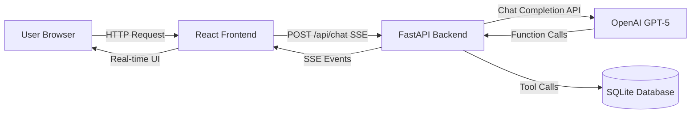

# AI Pharmacy Agent - Project

AI powered pharmacist assistant for a retail pharmacy chain project.
The agent able to serve customers through chat, using data from the pharmacy's internal data base ( once run you will see it under (backend/pharmacy.db) ).
The system uses function calling to interact with the pharmacy data base, suppoerts bilingual conversations ( English and Hebrew ), and enforces strict guidlines to avoid providing medical advices.

**See it in action:** Check out [conversation examples with screenshots](docs/SCREENSHOTS.md)

## Tech Stack

**Backend:**
- Python 3.11
- FastAPI (REST API + SSE streaming)
- SQLite (synthetic pharmacy database)
- OpenAI GPT-4o (vanilla API, no frameworks)

**Frontend:**
- React + TypeScript
- Vite (development and build)
- nginx (production serving in Docker)

**Deployment:**
- Docker Compose
- Server-Sent Events for streaming

## Running the project on your local machine

[Docker run guide](docs/docker_run.md)

## Architecture

The system is built on a few key design principles:

### Stateless Design
The frontend sends the full conversation history with each request. No server-side session storage.

### Event-Driven Streaming
The backend emits structured SSE events that the frontend renders in real-time.
Such as `assistant_token` and `tool_call`.

### Tool-First Facts
Any information about medications, stock, or prescriptions must come from a tool call to the database. The system prompt instructs the LLM not to hallucinate or invent data.

### Architecture Diagram



The flow:
1. User sends a message
2. Frontend streams the conversation to the backend via SSE
3. Backend calls OpenAI with the conversation + available tools
4. OpenAI decides which tools to call (if any)
5. Backend executes tool calls against SQLite
6. Tool results are sent back to OpenAI
7. OpenAI generates the final response
8. Backend streams everything back to the frontend via SSE

## Core Flows

Following the mission guidelines the system handles three main workflows.
Each demonstrates multi-run conversations and appropriate tool usage.
[Check here the document which covers the flows](docs/evaluation_plan.md)

## Project Structure

```
├── backend/                    # FastAPI application
│   ├── routers/               # API endpoints
│   │   ├── chat.py           # Main chat endpoint (SSE streaming)
│   │   ├── health.py         # Health check endpoint
│   │   └── medications.py    # Medication info endpoints
│   ├── services/              # Business logic
│   │   ├── openai_client.py  # OpenAI API client
│   │   └── agent_service.py  # Agent orchestration + tool calling loop
│   ├── tools/                 # Tool implementations
│   │   ├── registry.py       # Tool schemas and dispatcher
│   │   ├── medication_tools.py
│   │   ├── user_tools.py
│   │   └── prescription_tools.py
│   ├── repositories/          # Database access layer
│   │   ├── medication_repo.py
│   │   ├── user_repo.py
│   │   ├── prescription_repo.py
│   │   └── stock_repo.py
│   ├── prompts/               # System prompts
│   │   └── system_prompt.py  # Main assistant instructions
│   ├── schemas/               # Pydantic models
│   ├── tests/                 # pytest tests
│   │   ├── test_tools_medication.py
│   │   ├── test_agent_safety.py
│   │   └── test_normalization.py
│   ├── utils/                 # Utilities
│   │   └── normalization.py  # Input normalization (phone, email, branch names)
│   ├── main.py               # Application entry point
│   ├── database.py           # Database connection and schema
│   ├── seed_data.py          # Synthetic data population
│   └── requirements.txt      # Python dependencies
│
├── frontend/                  # React application
│   └── src/
│       ├── components/       # UI components
│       │   ├── ChatPage.tsx  # Main chat interface
│       │   ├── MessageList.tsx
│       │   ├── MessageInput.tsx
│       │   └── ToolActivity.tsx  # Tool call visualization
│       ├── hooks/
│       │   └── useChatStream.ts  # SSE streaming hook
│       ├── types/            # TypeScript types
│       │   └── chat.ts
│       ├── App.tsx
│       └── main.tsx
│
├── docs/                      # Documentation
│   ├── SCREENSHOTS.md        # Conversation examples with images
│   ├── evaluation_plan.md    # Test scenarios and evaluation criteria
│   ├── docker_run.md         # Detailed Docker instructions
│   ├── DATABASE_SCHEMA.md    # Database structure and sample data
│   └── decisions.md          # Architecture decisions
│
├── docker-compose.yml        # Docker orchestration
├── .gitignore
└── README.md                 # This file
```
