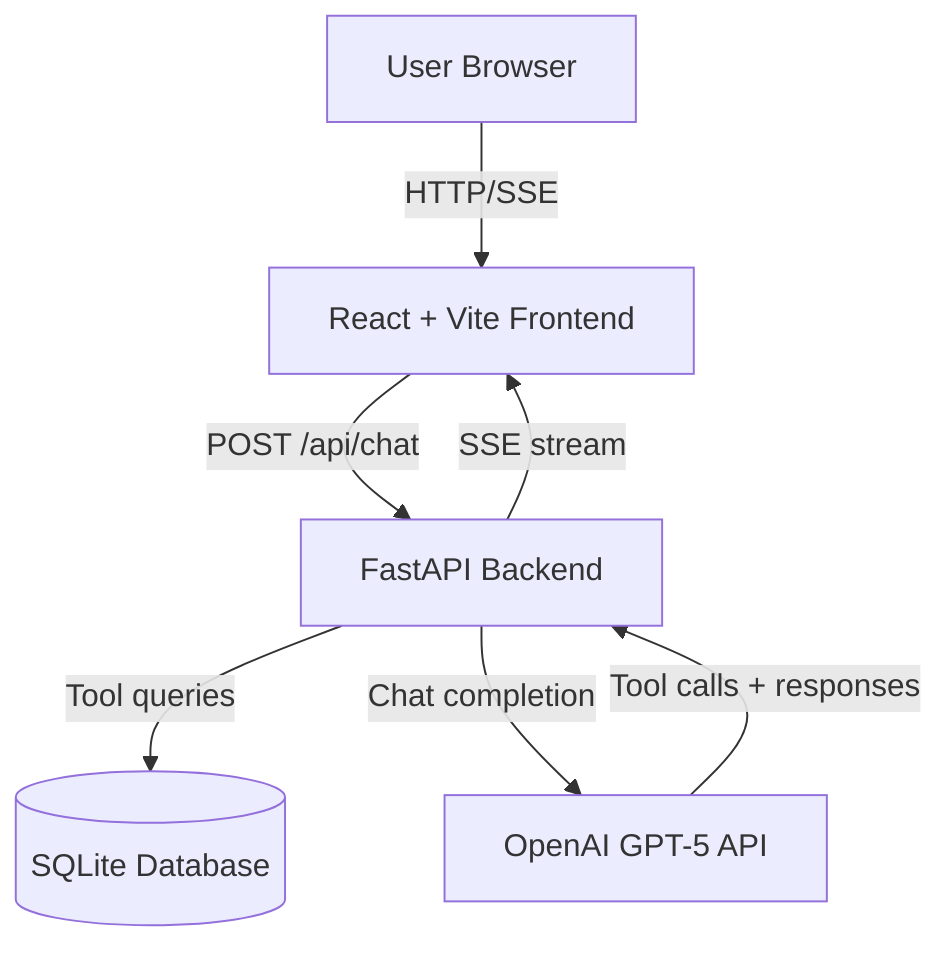
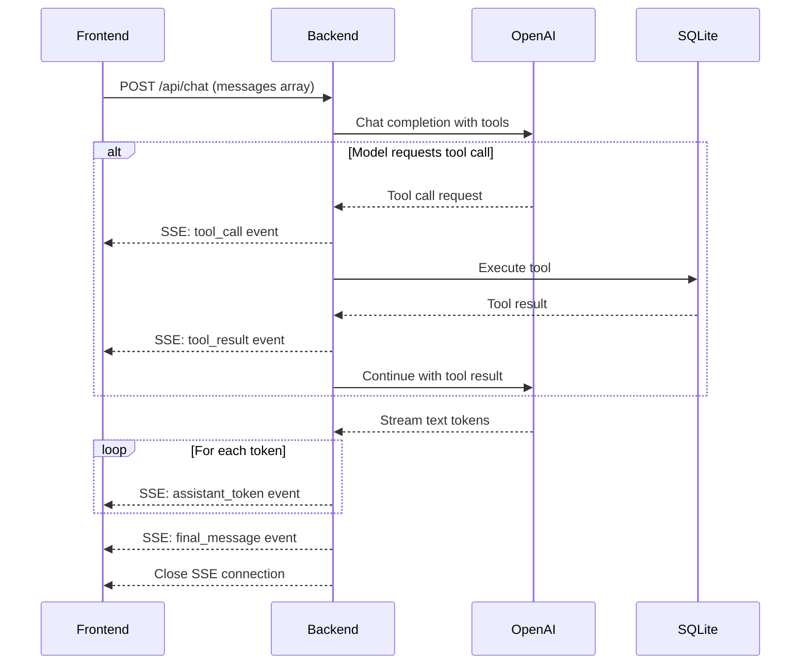
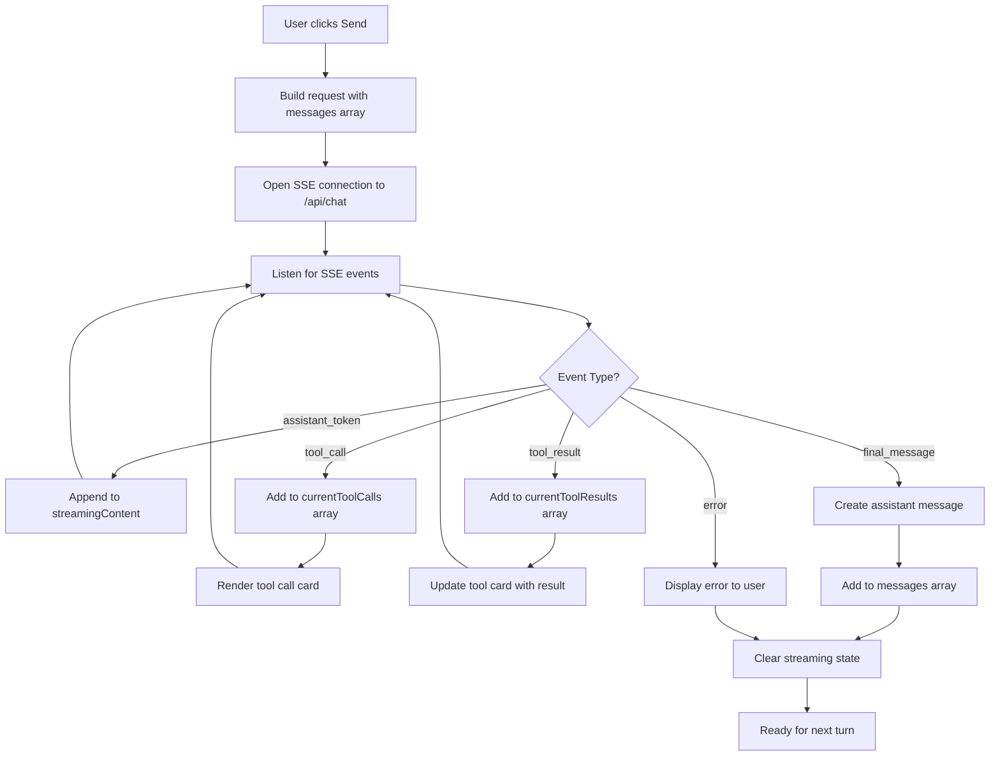

<!-- 8f1e0cfa-a99d-4ba1-802e-3575aa40e52c 63da102f-c7eb-499b-a88e-e56aa50a56df -->
# Pharmacy Assistant Chat System - Implementation Plan

## A) Architecture Overview

### Components



### Stateless Request/Response Flow

**Stateless principle**: Each request from the frontend includes the entire conversation context needed for that turn. The backend does not maintain session state between requests.

**Request flow**:

1. Frontend sends `POST /api/chat` with:

                                                - `messages`: Array of all conversation messages (system, user, assistant, tool)
                                                - `user_id`: Optional user identifier for tool operations

2. Backend forwards messages to OpenAI with tools schema
3. Backend handles tool calling loop (may call OpenAI multiple times in one request)
4. Backend streams events back to frontend via SSE

### Streaming Approach (SSE)



**SSE Event Flow**:

- Backend opens SSE stream immediately on `/api/chat`
- Events flow from OpenAI → Backend → UI in real-time
- Each event is a structured JSON payload with a `type` field
- Tool calls may trigger multiple round-trips to OpenAI before final response

## B) Concrete API Contract

### HTTP Endpoints

#### 1. `POST /api/chat`

Primary chat endpoint with SSE streaming response.

**Request Body**:

```json
{
  "messages": [
    {
      "role": "system",
      "content": "System prompt..."
    },
    {
      "role": "user",
      "content": "Do you have aspirin in stock?"
    },
    {
      "role": "assistant",
      "content": "Let me check our inventory for you.",
      "tool_calls": [
        {
          "id": "call_123",
          "type": "function",
          "function": {
            "name": "check_medication_stock",
            "arguments": "{\"medication_name\": \"aspirin\"}"
          }
        }
      ]
    },
    {
      "role": "tool",
      "tool_call_id": "call_123",
      "name": "check_medication_stock",
      "content": "{\"in_stock\": true, \"quantity\": 50}"
    }
  ],
  "user_id": "user_001"
}
```

**Response**: SSE stream with `Content-Type: text/event-stream`

**SSE Event Types**:

```typescript
// 1. Assistant text token (streamed incrementally)
{
  "type": "assistant_token",
  "content": "כן, יש לנו "  // or "Yes, we have "
}

// 2. Tool call initiated
{
  "type": "tool_call",
  "tool_call_id": "call_123",
  "name": "check_medication_stock",
  "arguments": {
    "medication_name": "aspirin"
  }
}

// 3. Tool execution result
{
  "type": "tool_result",
  "tool_call_id": "call_123",
  "name": "check_medication_stock",
  "result": {
    "in_stock": true,
    "quantity": 50,
    "branch": "Main Street"
  },
  "success": true
}

// 4. Tool execution error
{
  "type": "tool_result",
  "tool_call_id": "call_456",
  "name": "reserve_medication",
  "error": "User not found",
  "success": false
}

// 5. Final message complete
{
  "type": "final_message",
  "content": "Yes, we have 50 units of aspirin in stock at Main Street branch.",
  "tool_calls": [...]  // Array of all tool calls made
}

// 6. Error (unexpected failures)
{
  "type": "error",
  "error": "OpenAI API rate limit exceeded",
  "code": "rate_limit_error"
}
```

#### 2. `GET /api/health`

Health check endpoint.

**Response**:

```json
{
  "status": "ok",
  "database": "connected",
  "openai": "configured"
}
```

#### 3. `GET /api/medications` (optional, for debugging)

List all medications in the database.

**Response**:

```json
{
  "medications": [
    {
      "id": 1,
      "name": "Aspirin",
      "hebrew_name": "אספירין",
      "active_ingredient": "Acetylsalicylic acid"
    }
  ]
}
```

## C) Database Design + Seed Plan

### Tables

#### `users`

- `id` (INTEGER PRIMARY KEY)
- `name` (TEXT, e.g., "David Cohen")
- `hebrew_name` (TEXT, e.g., "דוד כהן")
- `phone` (TEXT)
- `email` (TEXT)

**Seed**: 10 users with Hebrew and English names

#### `medications`

- `id` (INTEGER PRIMARY KEY)
- `name` (TEXT, e.g., "Aspirin")
- `hebrew_name` (TEXT, e.g., "אספירין")
- `active_ingredient` (TEXT)
- `active_ingredient_hebrew` (TEXT)
- `dosage_form` (TEXT, e.g., "Tablet")
- `strength` (TEXT, e.g., "500mg")
- `usage_instructions` (TEXT, factual label info only)
- `usage_instructions_hebrew` (TEXT)
- `requires_prescription` (BOOLEAN)

**Seed**: 5 medications (mix of OTC and prescription):

- Aspirin (OTC)
- Ibuprofen (OTC)
- Amoxicillin (Prescription)
- Omeprazole (Prescription)
- Vitamin D3 (OTC)

#### `prescriptions`

- `id` (INTEGER PRIMARY KEY)
- `user_id` (INTEGER, FK to users)
- `medication_id` (INTEGER, FK to medications)
- `prescribed_date` (DATE)
- `expiry_date` (DATE)
- `refills_allowed` (INTEGER)
- `refills_used` (INTEGER)
- `prescribing_doctor` (TEXT)

**Seed**: 15-20 prescriptions across the 10 users

#### `stock`

- `id` (INTEGER PRIMARY KEY)
- `medication_id` (INTEGER, FK to medications)
- `branch` (TEXT, e.g., "Main Street", "Downtown")
- `quantity` (INTEGER)
- `last_updated` (TIMESTAMP)

**Seed**: Stock entries for each medication across 2-3 branches (some with zero stock for realistic scenarios)

#### `refill_requests` (optional, for Flow C)

- `id` (INTEGER PRIMARY KEY)
- `user_id` (INTEGER, FK to users)
- `prescription_id` (INTEGER, FK to prescriptions)
- `request_date` (TIMESTAMP)
- `status` (TEXT, e.g., "pending", "approved", "rejected")

**Seed**: Start empty or with 2-3 historical examples

### Seed Data Strategy

- Bilingual: All customer-facing text in both English and Hebrew
- Realistic names: Mix of Israeli and international names
- Stock variety: Some meds fully stocked, some low stock, some out of stock at certain branches
- Prescription validity: Mix of active, expired, and fully-used prescriptions
- Edge cases: Users with no prescriptions, medications with no stock anywhere

## D) Tool/Function Schemas

### Tool 1: `get_medication_info`

**Purpose**: Retrieve detailed information about a medication (name, ingredient, dosage, usage).

**Input Schema**:

```json
{
  "name": "get_medication_info",
  "description": "Get detailed information about a medication including its active ingredient, dosage form, strength, usage instructions, and whether it requires a prescription. Use this when a user asks about a specific medication.",
  "parameters": {
    "type": "object",
    "properties": {
      "medication_name": {
        "type": "string",
        "description": "The name of the medication in English or Hebrew"
      }
    },
    "required": ["medication_name"]
  }
}
```

**Output Schema**:

```json
{
  "success": true,
  "medication": {
    "name": "Aspirin",
    "hebrew_name": "אספירין",
    "active_ingredient": "Acetylsalicylic acid",
    "dosage_form": "Tablet",
    "strength": "500mg",
    "usage_instructions": "Take 1-2 tablets every 4-6 hours as needed. Do not exceed 8 tablets in 24 hours.",
    "requires_prescription": false
  }
}
```

**Possible Errors**: `"Medication not found in database"`

### Tool 2: `check_medication_stock`

**Purpose**: Check if a medication is in stock and at which branches.

**Input Schema**:

```json
{
  "name": "check_medication_stock",
  "description": "Check the current stock availability of a medication across pharmacy branches. Returns quantity and branch locations.",
  "parameters": {
    "type": "object",
    "properties": {
      "medication_name": {
        "type": "string",
        "description": "The name of the medication to check"
      }
    },
    "required": ["medication_name"]
  }
}
```

**Output Schema**:

```json
{
  "success": true,
  "medication_name": "Aspirin",
  "stock": [
    {
      "branch": "Main Street",
      "quantity": 50,
      "available": true
    },
    {
      "branch": "Downtown",
      "quantity": 0,
      "available": false
    }
  ]
}
```

**Possible Errors**: `"Medication not found"`, `"No stock information available"`

### Tool 3: `reserve_medication`

**Purpose**: Simulate reserving medication for pickup (requires user identification).

**Input Schema**:

```json
{
  "name": "reserve_medication",
  "description": "Reserve a medication for pickup at a specific branch. Requires user to be identified first. This is a simulation only.",
  "parameters": {
    "type": "object",
    "properties": {
      "user_id": {
        "type": "string",
        "description": "The user's ID"
      },
      "medication_name": {
        "type": "string",
        "description": "The medication to reserve"
      },
      "branch": {
        "type": "string",
        "description": "The branch where the medication will be picked up"
      },
      "quantity": {
        "type": "integer",
        "description": "Number of units to reserve (default 1)"
      }
    },
    "required": ["user_id", "medication_name", "branch"]
  }
}
```

**Output Schema**:

```json
{
  "success": true,
  "reservation_id": "RES123456",
  "message": "Reserved 1 unit of Aspirin at Main Street branch. Please pick up within 24 hours.",
  "pickup_deadline": "2025-12-26T10:30:00Z"
}
```

**Possible Errors**: `"User not found"`, `"Insufficient stock"`, `"Branch not found"`

### Tool 4: `lookup_user_prescriptions`

**Purpose**: Find a user's active prescriptions (needed for prescription refills and validation).

**Input Schema**:

```json
{
  "name": "lookup_user_prescriptions",
  "description": "Look up a user's active prescriptions. Can search by phone number, email, or name. Returns prescriptions with remaining refills.",
  "parameters": {
    "type": "object",
    "properties": {
      "search_term": {
        "type": "string",
        "description": "Phone number, email, or name to search for"
      }
    },
    "required": ["search_term"]
  }
}
```

**Output Schema**:

```json
{
  "success": true,
  "user": {
    "id": "user_001",
    "name": "David Cohen"
  },
  "prescriptions": [
    {
      "prescription_id": "RX001",
      "medication": "Omeprazole",
      "prescribed_date": "2025-10-15",
      "expiry_date": "2026-10-15",
      "refills_allowed": 5,
      "refills_used": 2,
      "refills_remaining": 3,
      "doctor": "Dr. Sarah Levi"
    }
  ]
}
```

**Possible Errors**: `"User not found"`, `"No active prescriptions found"`

### Tool 5: `request_prescription_refill`

**Purpose**: Submit a prescription refill request (simulation).

**Input Schema**:

```json
{
  "name": "request_prescription_refill",
  "description": "Submit a request to refill an existing prescription. Validates that the prescription is active and has refills remaining.",
  "parameters": {
    "type": "object",
    "properties": {
      "user_id": {
        "type": "string",
        "description": "The user's ID"
      },
      "prescription_id": {
        "type": "string",
        "description": "The prescription ID to refill"
      },
      "preferred_branch": {
        "type": "string",
        "description": "Branch where user wants to pick up (optional)"
      }
    },
    "required": ["user_id", "prescription_id"]
  }
}
```

**Output Schema**:

```json
{
  "success": true,
  "refill_request_id": "REF789",
  "message": "Refill request submitted successfully. It will be ready for pickup at Main Street branch in 2-3 hours.",
  "estimated_ready_time": "2025-12-25T13:00:00Z"
}
```

**Possible Errors**: `"Prescription expired"`, `"No refills remaining"`, `"Prescription not found"`, `"User mismatch"`

### Tool 6: `check_active_ingredients`

**Purpose**: Get active ingredient information for medication (useful for allergy checks, generic alternatives).

**Input Schema**:

```json
{
  "name": "check_active_ingredients",
  "description": "Get the active pharmaceutical ingredient(s) of a medication. Useful for checking for allergies or finding generic alternatives.",
  "parameters": {
    "type": "object",
    "properties": {
      "medication_name": {
        "type": "string",
        "description": "The medication name"
      }
    },
    "required": ["medication_name"]
  }
}
```

**Output Schema**:

```json
{
  "success": true,
  "medication": "Aspirin",
  "active_ingredients": [
    {
      "name": "Acetylsalicylic acid",
      "hebrew_name": "חומצה אצטילסליצילית"
    }
  ],
  "similar_medications": ["Acylpyrin", "Disprin"]
}
```

**Possible Errors**: `"Medication not found"`

## E) Prompting / Policy Strategy

### System Prompt Structure

```text
You are a helpful pharmacy assistant for [Pharmacy Name]. You assist customers with medication information, prescription management, and stock availability.

LANGUAGE: You are bilingual (English and Hebrew). Respond in the language the user speaks. If the user switches languages, switch with them.

YOUR CAPABILITIES:
- Provide factual medication information (name, active ingredients, dosage, usage instructions from our database)
- Check medication stock availability at our branches
- Look up user prescriptions and prescription status
- Help with prescription refill requests
- Verify prescription requirements for medications

STRICT SAFETY RULES (CRITICAL):
1. NEVER provide medical advice, diagnosis, or treatment recommendations
2. NEVER suggest which medication someone should take for a condition
3. NEVER advise on medication safety for specific individuals ("is it safe for me?")
4. If asked for medical advice, politely refuse and redirect to a pharmacist or doctor:
                           - "I cannot provide medical advice. Please consult with our pharmacist or your doctor."
                           - "אני לא יכול לתת ייעוץ רפואי. אנא התייעץ עם הרוקח שלנו או עם הרופא שלך."

DATA INTEGRITY RULES:
1. ALWAYS use tools to fetch data from our database
2. NEVER guess or make up medication information, stock levels, or user data
3. If you need information, call the appropriate tool
4. If a tool returns no results or an error, inform the user honestly

CONVERSATION BEHAVIOR:
1. Ask clarifying questions when user requests are ambiguous
2. For prescription lookups/refills, ask for identification (phone/email/name)
3. Be friendly, clear, and professional
4. Confirm actions before simulating them (e.g., "Should I reserve this for you?")
5. Keep responses concise but complete

Available tools: get_medication_info, check_medication_stock, reserve_medication, lookup_user_prescriptions, request_prescription_refill, check_active_ingredients
```

### Stateless Context Management

For each request, include:

1. **System message** (always first)
2. **Conversation history**: Last N relevant turns (suggest N=10-15)

                                                - User messages
                                                - Assistant messages (including tool_calls)
                                                - Tool messages (results from previous calls)

3. **New user message**

**What to exclude**:

- Very old messages (beyond 10-15 turns) to save tokens
- Redundant tool results if the same info was fetched multiple times

**Frontend responsibility**:

- Store the entire conversation in React state
- Send relevant context window with each request
- Update local state with new assistant messages and tool results from SSE

## F) UI Plan

### Simple Wireframe (ASCII)

```
┌────────────────────────────────────────────────────────┐
│  Pharmacy Assistant Chat                    [ EN | עב ]│
├────────────────────────────────────────────────────────┤
│                                                        │
│  ┌─────────────────────────────────────────────────┐  │
│  │ User: Do you have aspirin?                      │  │
│  └─────────────────────────────────────────────────┘  │
│                                                        │
│      ┌─────────────────────────────────────────────┐  │
│      │ Assistant: Let me check our inventory...    │  │
│      └─────────────────────────────────────────────┘  │
│                                                        │
│      ┌────────────────────────────────────────────┐   │
│      │ 🔧 Tool Call: check_medication_stock       │   │
│      │    medication_name: "aspirin"              │   │
│      │ ✓ Result: In stock (50 units, Main St)    │   │
│      └────────────────────────────────────────────┘   │
│                                                        │
│      ┌─────────────────────────────────────────────┐  │
│      │ Assistant: Yes! We have 50 units of        │  │
│      │ aspirin in stock at our Main Street        │  │
│      │ branch.                                     │  │
│      └─────────────────────────────────────────────┘  │
│                                                        │
│  ┌─────────────────────────────────────────────────┐  │
│  │ User: Can you reserve one for me?              │  │
│  └─────────────────────────────────────────────────┘  │
│                                                        │
│      ┌─────────────────────────────────────────────┐  │
│      │ Assistant: [streaming...] Sure! I'll need  │  │
│      │ to identify you first...▊                   │  │
│      └─────────────────────────────────────────────┘  │
│                                                        │
└────────────────────────────────────────────────────────┘
│  Type your message...                          [Send] │
└────────────────────────────────────────────────────────┘
```

### State Model (React)

```typescript
interface Message {
  role: 'user' | 'assistant' | 'system';
  content: string;
  tool_calls?: ToolCall[];  // Present on assistant messages that called tools
}

interface ToolCall {
  id: string;
  name: string;
  arguments: Record<string, any>;
}

interface ToolResult {
  tool_call_id: string;
  name: string;
  result?: any;  // Success result
  error?: string;  // Error message
  success: boolean;
}

interface AppState {
  // Full conversation history (stateless - sent with each request)
  messages: Message[];
  
  // Current streaming message being built
  streamingContent: string;
  
  // Tool calls/results for the current turn (before finalized into message)
  currentToolCalls: ToolCall[];
  currentToolResults: ToolResult[];
  
  // UI state
  isStreaming: boolean;
  error: string | null;
}
```

### SSE Consumption Flow



**How UI consumes SSE**:

1. **On send**: Clear streaming state, open EventSource to `/api/chat` with POST body (using fetch polyfill or custom SSE client)
2. **assistant_token**: Append token to `streamingContent` buffer → re-render
3. **tool_call**: Add to `currentToolCalls` → render new tool card (show name + args, status "executing")
4. **tool_result**: Find matching tool call by ID → update card with result/error, status "success"/"error"
5. **final_message**: Package everything into a Message object → add to `messages` → clear streaming buffers
6. **error**: Display error alert/toast, stop streaming
7. **Connection close**: Clean up EventSource

**Tool Card Component**:

```typescript
interface ToolCardProps {
  toolCall: ToolCall;
  toolResult?: ToolResult;
}

// Renders:
// - Tool name (e.g., "check_medication_stock")
// - Arguments (formatted JSON or key-value pairs)
// - Result/error (formatted, color-coded)
// - Status indicator (loading spinner → checkmark/X)
```

## G) Milestones

### Milestone 1: Backend Skeleton + Database

**Goal**: FastAPI server running with SQLite DB and seed data.

**Tasks**:

- Set up FastAPI project structure (`backend/` directory)
- Create SQLite schema (all tables)
- Write seed data script (10 users, 5 medications, prescriptions, stock)
- Implement `/api/health` endpoint
- Test: `curl http://localhost:8000/api/health` returns `{"status": "ok"}`

**Done when**: Server starts, DB is populated, health check works.

### Milestone 2: OpenAI Integration + Tool Execution

**Goal**: Backend can call OpenAI with tools and execute them against DB.

**Tasks**:

- Implement all 6 tool functions (Python functions that query SQLite)
- Create OpenAI tools schema (JSON)
- Implement tool calling loop (call OpenAI → execute tool → send result back → repeat until done)
- Add environment variable for `OPENAI_API_KEY`
- Test: Mock a request with messages array, verify tools are called correctly (use print statements)

**Done when**: Can manually trigger a tool call flow and see correct DB results.

### Milestone 3: SSE Streaming Endpoint

**Goal**: `/api/chat` endpoint streams SSE events.

**Tasks**:

- Implement `POST /api/chat` with SSE response
- Parse incoming `messages` array
- Stream events: `assistant_token`, `tool_call`, `tool_result`, `final_message`, `error`
- Handle OpenAI streaming API (stream text tokens)
- Test: Use `curl` or Postman to send request, verify SSE events are emitted

**Done when**: Can send a chat request and receive structured SSE events in terminal.

### Milestone 4: Frontend Chat UI (Basic)

**Goal**: React app with message list and input box.

**Tasks**:

- Set up React + Vite project (`frontend/` directory)
- Create chat interface (message list + input + send button)
- Implement messages state (array of Message objects)
- Add basic styling (simple, clean, no fancy animations)
- Test: Can type and display user/assistant messages in UI (hardcoded for now)

**Done when**: UI renders messages and input works (no backend connection yet).

### Milestone 5: Frontend SSE Integration

**Goal**: Frontend connects to `/api/chat` and renders streaming responses.

**Tasks**:

- Implement SSE client (EventSource or fetch with streaming)
- Handle all 5 event types (assistant_token, tool_call, tool_result, final_message, error)
- Update state on each event
- Render streaming text with cursor effect (optional)
- Test: Send a message, see streaming response appear in real-time

**Done when**: Full request/response cycle works, text streams into UI.

### Milestone 6: Tool Call Visualization

**Goal**: UI displays tool call cards during streaming.

**Tasks**:

- Create ToolCard component
- Render tool calls with name, args, and results
- Color-code success (green) vs error (red)
- Show loading state while tool is executing
- Test: Trigger a tool call flow, verify cards appear and update

**Done when**: Tool calls are visible and easy to understand in UI.

### Milestone 7: Multi-step Flows + Policy Enforcement

**Goal**: Implement and test 3 flows, enforce safety rules.

**Tasks**:

- Test Flow A: Medication info + prescription + ingredients
- Test Flow B: Stock check + reservation
- Test Flow C: User lookup + refill request
- Add safety prompt rules to system message
- Test medical advice refusal (ask "should I take aspirin for headaches?")
- Test in both English and Hebrew
- Document flows in `docs/evaluation_plan.md`

**Done when**: All 3 flows work end-to-end, safety rules are enforced, bilingual works.

### Milestone 8: Docker + Deployment Prep

**Goal**: Dockerized setup with docker-compose.

**Tasks**:

- Write `Dockerfile` for backend (Python + FastAPI)
- Write `Dockerfile` for frontend (Node + Vite build)
- Create `docker-compose.yml` (backend + frontend services)
- Add `.env` file support for `OPENAI_API_KEY`
- Test: `docker-compose up` starts both services, can access UI in browser

**Done when**: Full stack runs in Docker, accessible at `http://localhost:3000`.

### Milestone 9: Testing + Screenshots

**Goal**: Manual testing, capture evidence.

**Tasks**:

- Test all 3 flows with variations (edge cases, Hebrew, English)
- Take 2-3 screenshots showing tool calls and multi-step flows
- Test error handling (expired prescription, out of stock, user not found)
- Verify policy enforcement (medical advice refusal)
- Document evaluation results

**Done when**: Screenshots captured, flows tested and working.

### Milestone 10: Final Polish + Documentation

**Goal**: Clean up code, write README (by you, not me).

**Tasks**:

- Code cleanup (remove debug prints, format code)
- Add comments to complex sections
- YOU write `README.md` (I will not generate it - per assignment requirement)
- Add `docs/evaluation_plan.md` with flow descriptions and test cases
- Verify all requirements from mission.txt are met
- Final test: Fresh `docker-compose up` on a clean machine

**Done when**: Project is ready for submission, README is written by you.

---

## Assumptions Made

1. **User identification**: For simplicity, user can provide phone/email/name to look up their account. No authentication/login required.
2. **Branch list**: We'll use 2-3 hardcoded branches (e.g., "Main Street", "Downtown", "Airport").
3. **Hebrew support**: All user-facing text fields in DB will have Hebrew equivalents. System will detect language from user input.
4. **Token limit**: We'll keep conversation context to last 10-15 turns to avoid excessive token usage.
5. **Reservation/refill simulation**: These are simulated operations (no real pharmacy integration). We'll just create records and return success messages.
6. **Error handling**: Tools will return structured error objects; UI will display them clearly.
7. **Streaming performance**: We'll stream tokens immediately as received from OpenAI (no buffering).
8. **No authentication**: This is a demo system, so no API keys, user auth, or rate limiting on the chat endpoint.

### To-dos

- [ ] Backend skeleton + SQLite database with seed data
- [ ] OpenAI integration with tool calling loop
- [ ] SSE streaming endpoint implementation
- [ ] Basic React chat UI (no backend connection)
- [ ] Frontend SSE integration with backend
- [ ] Tool call cards and visualization in UI
- [ ] Multi-step flows + safety policy enforcement
- [ ] Docker + docker-compose setup
- [ ] Manual testing + screenshots
- [ ] Final polish + documentation (README by user)